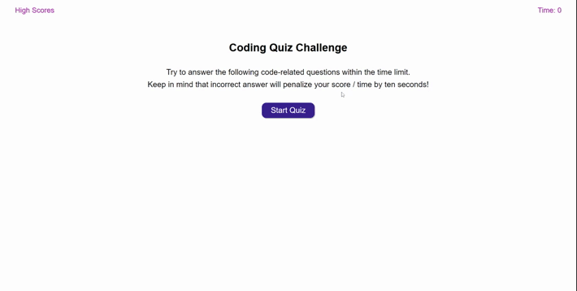

# *Quiz*
## Version 1.0
### Built with HTML, CSS and JAVASCRIPT
### [Link to "Quiz" page](https://jamwalab.github.io/quiz/)

### Project description
* Clicking on start quiz starts the timer and displays the question.
* Clicking on any option moves it to the next question.
* Result of the previous question (wrong or correct) is displayed at the bottom for 3 seconds.
* For incorrect answer 10 seconds are deducted from the timer.
* Quiz stops when all questions (6) are answered or the timer reaches 0.
* At the end, final score is displayed and input box to enter initials.
* Once submited high scores are displayed.
* Only top 10 high scores are displayed.
* Clicking High Scores on the header displays top 10 high scores as well.
* High score page has the option to go back to the main page or delete all stored scores.

### Build process
* The display is created dynamically based on requirements and function arguments received.
* In general, display is divided into four sections, if an argument is blank that section is not created.
* Buttons are generated with an array argument, alowing us to dynamically change the number of buttons generated.
* Questions are in the form of array of objects with three elements in each object - question, array of options and answer.
* Timer starts and 75 and runs until all questions are answered or till it reaches 0.
* Small exceptions are added to match the requirements.
* Answers to previous questions and other messages are passed as arguments to be displayed at the bottom.
* At the end of quiz, score is displayed as the time left and on entering the initials, name and score is recorded.
* If the score is in the top 10 scores recorded among all the scores stored in the local storage, it gets added and saved.
* High scores are displayed in decending order with the highest on top.
* Small touches:
    * In the last 10 seconds time is displayed in red.
    * Width of all the option buttons are the same.
    * On mouseover over the buttons, cursor changes.
    * On mouseover over the High Score in header, cursor changes and there is a slight zoom.
    * Transition delay when colour changes on button mouseover.
    * Input validation for input box. When blank, message is displayed a the bottom asking to try again.